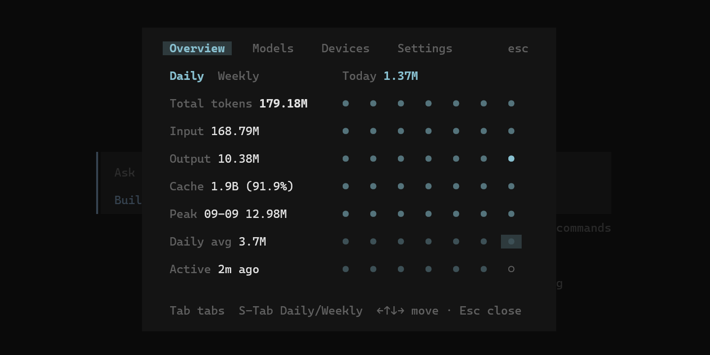

# opencode-usage-stats-plugin

简体中文 | [English](README.md)

一个 [OpenCode](https://opencode.ai) 插件，用于追踪 LLM Token 用量并在终端 UI 中展示交互式统计面板。



## 功能特性

- **Token 追踪** -- 自动记录每次 LLM 调用的 input、output、cache 和 reasoning tokens
- **多设备** -- 通过主机名标识，跨多台机器聚合使用数据
- **热力图概览** -- 按日 / 按周的活动热力图，带趋势级别
- **模型分布** -- 按 provider / model 分组的 Token 消耗条形图
- **设备分布** -- 按设备分组的用量统计，含最后活跃时间
- **时区感知** -- 可配置时区（10 个预设），所有聚合计算正确处理 DST / 闰年边界
- **崩溃安全** -- SQLite WAL 模式 + busy-timeout 重试，已提交数据可在进程被杀后恢复
- **键鼠支持** -- 完整的键盘导航（方向键、Tab、Shift+Tab）和鼠标点击
- **响应式布局** -- 自适应窄终端，自动切换堆叠布局

## 环境要求

- [OpenCode](https://opencode.ai) >= 1.18.30, < 1.19.0
- [Bun](https://bun.sh) 运行时（用于构建和运行测试）

## 安装

1. 克隆仓库：

   ```bash
   git clone https://github.com/qiming-zhao/opencode-usage-stats-plugin.git
   cd opencode-usage-stats-plugin
   ```

2. 安装依赖：

   ```bash
   bun install
   ```

3. 构建插件：

   ```bash
   bun run build
   ```

4. 在 OpenCode 配置文件中注册插件：

   在 `~/.config/opencode/opencode.json` 中添加 Server 插件：

   ```jsonc
   {
     "plugin": [
       "/absolute/path/to/opencode-usage-stats-plugin/dist/server.mjs"
     ]
   }
   ```

   在 `~/.config/opencode/tui.json` 中添加 TUI 插件：

   ```jsonc
   {
     "plugin": [
       "/absolute/path/to/opencode-usage-stats-plugin/dist/tui.mjs"
     ]
   }
   ```

5. 重启 OpenCode，插件将自动开始追踪用量。

## 使用

在 OpenCode 中打开用量面板：

- 斜杠命令：输入 `/usage`
- 命令面板：搜索 **Usage stats**

### 快捷键

| 按键 | 操作 |
|------|------|
| `Tab` | 切换标签页（Overview / Models / Devices / Settings） |
| `Shift+Tab` | 切换日视图 / 周视图（Overview 标签页） |
| `方向键` | 导航热力图单元格 |
| `Esc` | 关闭面板 |

## 配置

插件从插件根目录的 `stats.config.json` 读取配置：

```json
{
  "dataDir": "./data",
  "timeZone": "Asia/Shanghai"
}
```

| 字段 | 说明 | 默认值 |
|------|------|--------|
| `dataDir` | SQLite 数据库存储目录 | `./data` |
| `timeZone` | IANA 时区，用于日期边界计算 | `Asia/Shanghai` |

时区也可以在 TUI 面板的 Settings 标签页中更改。

## 开发

```bash
# 安装依赖
bun install

# 构建
bun run build

# 运行测试
bun test

# 类型检查
bun run typecheck
```

详见 [CONTRIBUTING.md](CONTRIBUTING.md)。

## 架构

```
src/
├── server.ts      # 服务端插件入口（事件监听 + 重试队列）
├── tui.tsx        # 终端 UI 面板（SolidJS + @opentui）
├── collector.ts   # 事件捕获 / Token 提取
├── store.ts       # SQLite 数据层（Schema、Upsert、聚合查询）
├── overview.ts    # 热力图与数字格式化
└── config.ts      # 配置文件读取
```

## 许可证

[MIT](LICENSE)
